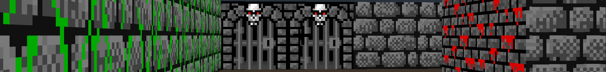
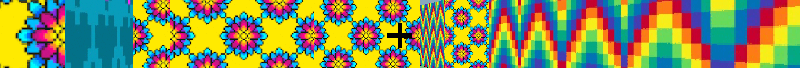
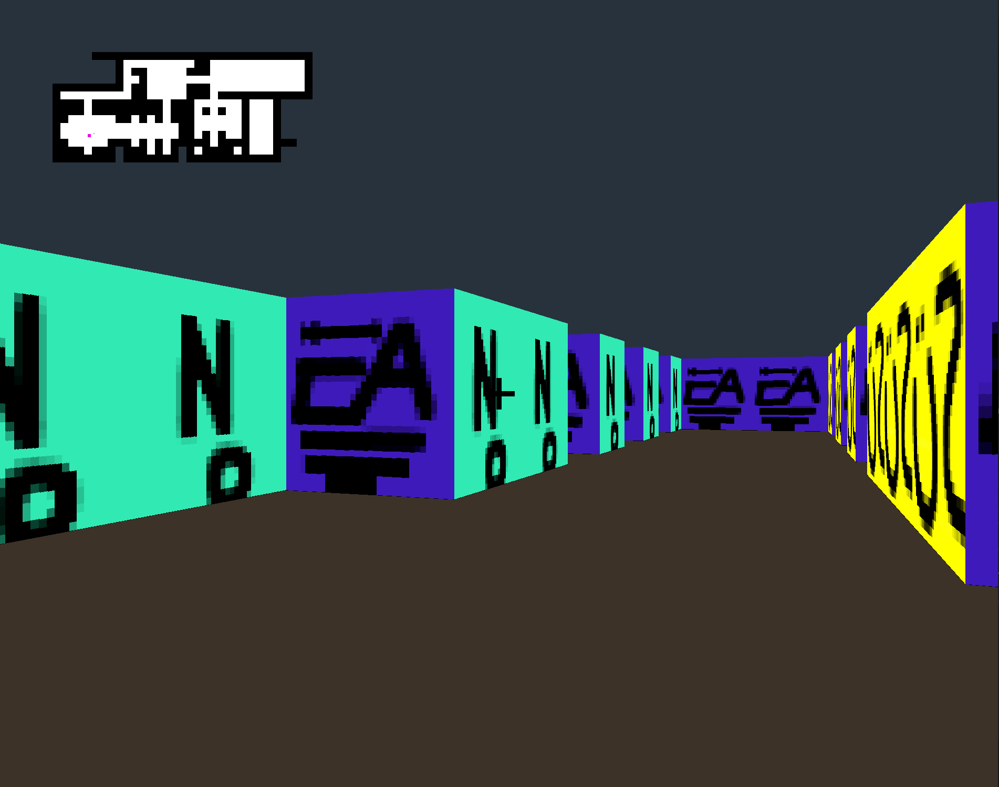
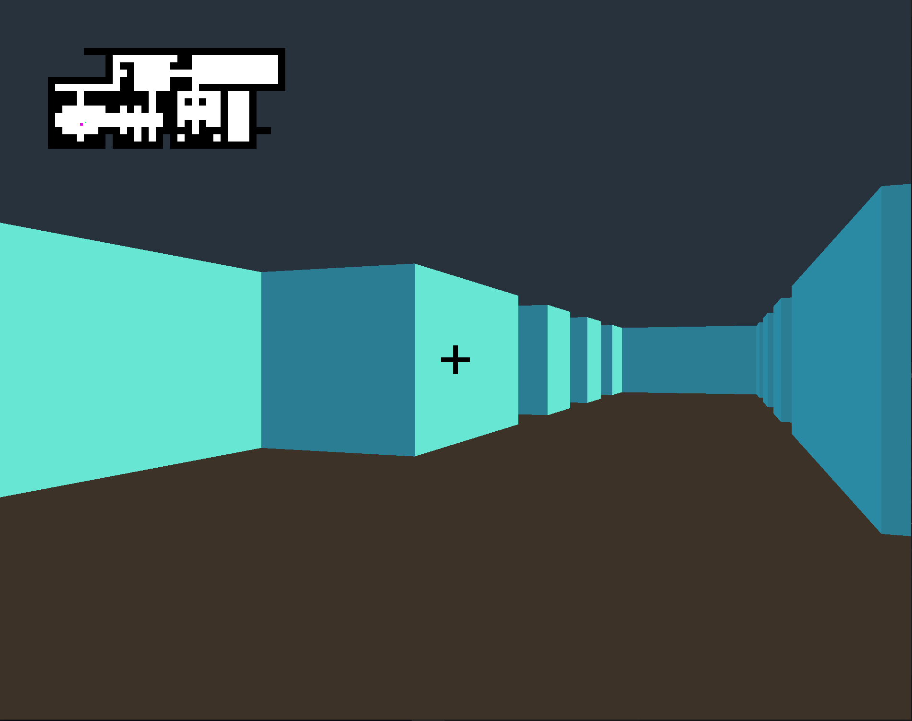
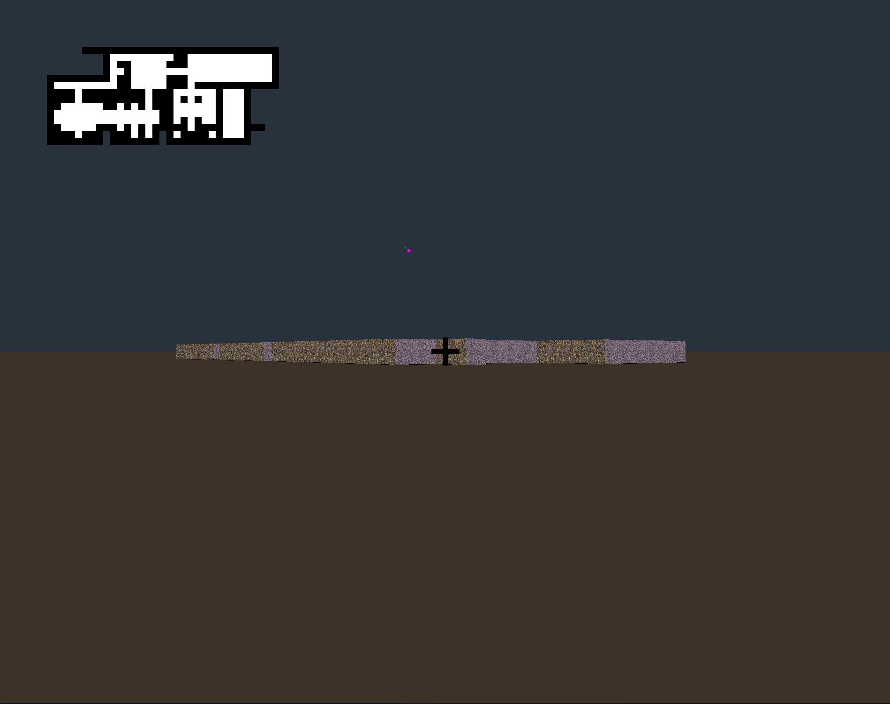
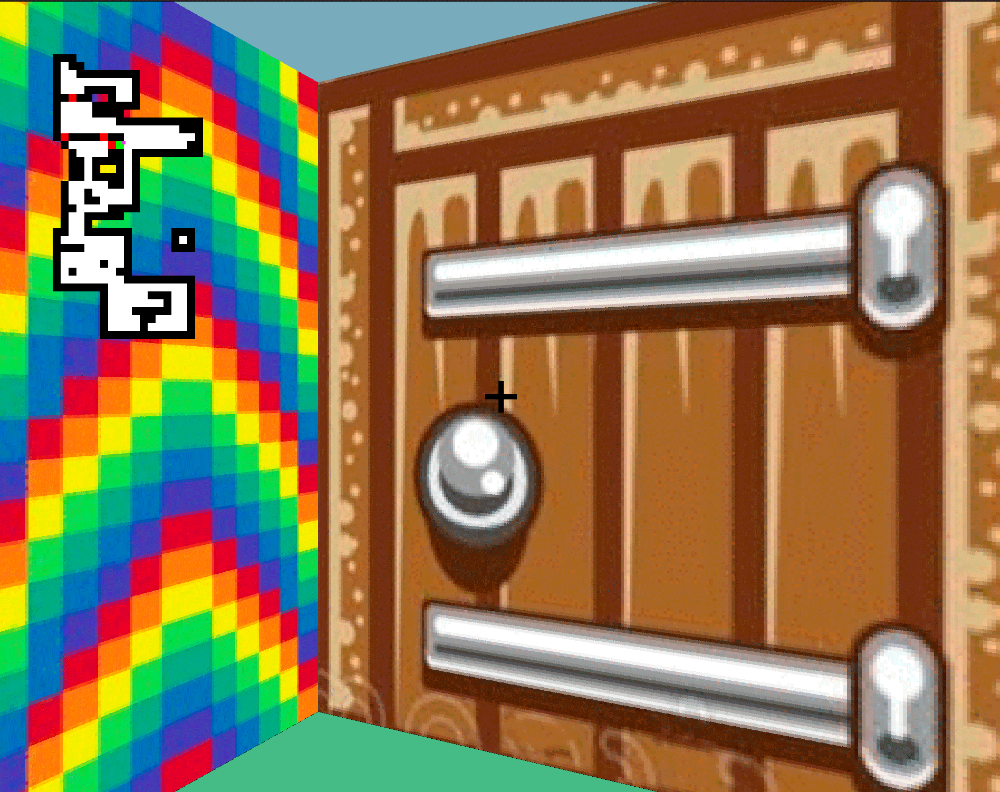
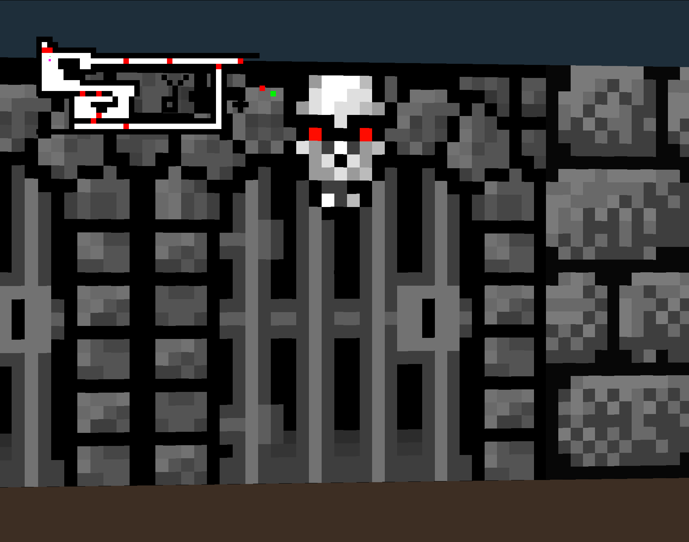

# <b>CUBE 3D</b>

## A 3d render from a 2d map using raycasting 

A student project of 42 written in C and using a basic graphic library. The purpose is to simulate the visual perception of a 3D environment in a 2D space using raycasting. Raycasting is a technique used in computer graphics often employed in early first-person shooter (FPS) games. It works by casting rays from a player's viewpoint and calculating intersections with objects in the virtual world to determine what is visible from that perspective. This method allows for the rendering of 3D environments on relatively low-powered hardware, making it crucial for the development of early FPS games.

One of the first FPS games to employ raycasting was "Wolfenstein 3D," developed by id Software and released in 1992.

## Walking through the maze

We added a ghost mode (removing texture) to enable going through the wall. The difficulty here was to prevent to cast ray out of map.

## Tiles power

With few tiles, one per cardinal direction, completly different universes can be build up.

